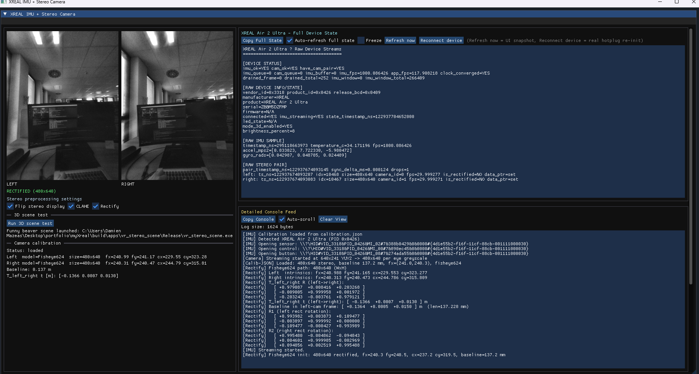
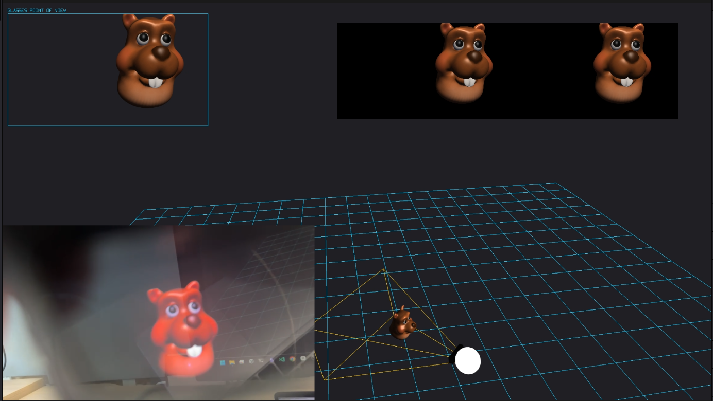
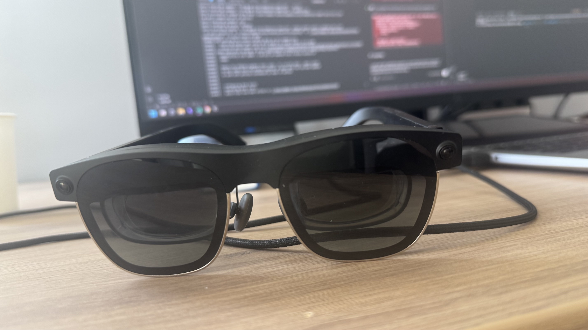

# myXreal

C++17 driver and desktop tooling for XREAL Air 2 Ultra: IMU streaming, stereo camera capture, rectification, and real-time debug visualization.

## Demo

`imu_debug` running against a connected pair of glasses — stereo feeds, IMU telemetry and the calibration panel, live.

[](https://video.agentxr.app/xreal-imu-stereo-camera-debug-dashboard-windows-pc-air-2/full.mp4)

*Click for the full clip (50s).*

## Screenshots

### Dashboard


### Stereo 3D


### XREAL glasses



## What is in this repo
- `imu_driver` shared library for IMU + stereo camera access.
- `imu_debug` GUI (ImGui + D3D11) with live stereo camera feeds, IMU diagnostics, calibration display, and a button to launch the local VR stereo scene.
- `imu_dump` CLI IMU stream viewer.
- `vr_scene_driver` static library (`src/vr_scene_driver`) used by the VR scene app.
- `vr_stereo_scene` standalone local SBS 3D scene app (funny beaver model) for XREAL glasses.
- `assets/funny_beaver.bin` local mesh asset copied next to `vr_stereo_scene.exe` at build time.

## Prerequisites (Windows)
- Visual Studio 2022 (x64 toolchain)
- CMake 3.20+
- vcpkg/system packages: Eigen3, OpenCV, yaml-cpp
- XREAL Air 2 Ultra connected for live device tests

## Build
```bash
cmake -S . -B build -DCMAKE_BUILD_TYPE=Release
cmake --build build --config Release

# Optional explicit targets
cmake --build build --config Release --target imu_debug
cmake --build build --config Release --target imu_dump
cmake --build build --config Release --target vr_stereo_scene
```

Debug build:
```bash
cmake -S . -B build -DCMAKE_BUILD_TYPE=Debug
cmake --build build --config Debug
```

## Run
From build outputs (DLLs/calibration are copied automatically by CMake post-build steps):

```bash
build/apps/imu_debug/Release/imu_debug.exe
build/apps/imu_dump/Release/imu_dump.exe
build/apps/vr_stereo_scene/Release/vr_stereo_scene.exe
```

From `imu_debug`, use **Run 3D scene test** to launch the local `vr_stereo_scene.exe` (no external repository dependency).

## Quick guidance
- Start with `imu_debug` for full device diagnostics.
- If calibration is not detected, verify `config/calibration.json` is present next to the executable.

## Calibration per glasses
Each pair of glasses has its own factory calibration.
- Keep one calibration JSON per device serial number.
- Pass the matching file when launching tools (or copy it next to the executable as `calibration.json`).
- Mixing calibration files between devices can degrade rectification and pose quality.

## Troubleshooting
- **No camera/IMU stream**: reconnect glasses, close conflicting camera apps, relaunch executable.
- **Build errors on OpenCV/Eigen/yaml-cpp**: verify dependency installation and CMake toolchain configuration.
- **No useful stereo image**: ensure both stereo eyes stream correctly and rectification is enabled.
